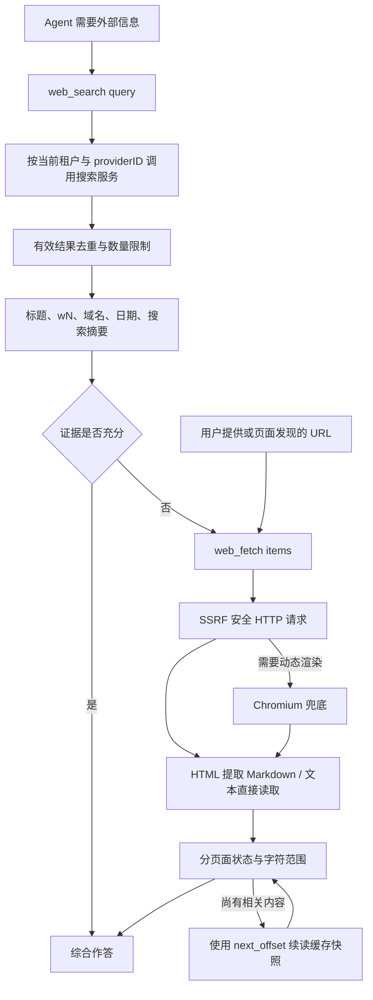
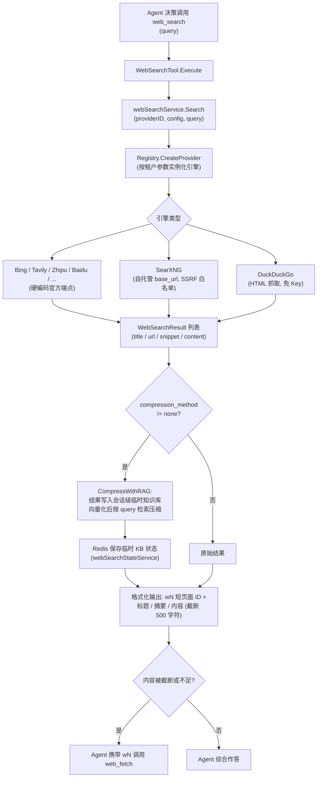
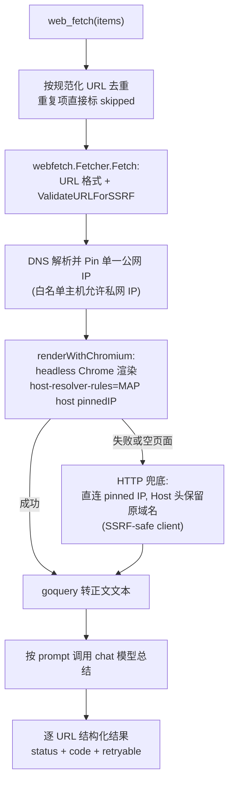

# 网络搜索与网页抓取

当知识库检索不足以回答问题时，WeKnora 的 Agent 可以借助 `web_search`（联网搜索）与 `web_fetch`（网页抓取 + LLM 分析）两个工具获取实时信息。底层实现分布在 `internal/infrastructure/web_search`（搜索引擎适配层）、`internal/infrastructure/web_fetch`（轻量抓取器）与 `internal/agent/tools`（Agent 工具层），并通过 `docker/searxng` 提供可选的自托管元搜索引擎。

在「设置 → 网络搜索」选择提供商、填写凭据并测试连接，然后在智能体中选择该搜索配置。搜索结果数受智能体的最大结果数设置约束。

## 支持的搜索引擎

引擎在 `internal/container/container.go` 的 `registerWebSearchProviders` 中注册：

```go
registry.Register("duckduckgo", infra_web_search.NewDuckDuckGoProvider)
registry.Register("google", infra_web_search.NewGoogleProvider)
registry.Register("bing", infra_web_search.NewBingProvider)
registry.Register("tavily", infra_web_search.NewTavilyProvider)
registry.Register("ollama", infra_web_search.NewOllamaProvider)
registry.Register("baidu", infra_web_search.NewBaiduProvider)
registry.Register("searxng", infra_web_search.NewSearxngProvider)
registry.Register("keenable", infra_web_search.NewKeenableProvider)
registry.Register("zhipu", infra_web_search.NewZhipuProvider)
registry.Register("exa", infra_web_search.NewExaProvider)
registry.Register("metaso", infra_web_search.NewMetasoProvider)
registry.Register("bocha", infra_web_search.NewBochaProvider)
registry.Register("brave", infra_web_search.NewBraveProvider)
registry.Register("serply", infra_web_search.NewSerplyProvider)
```

| 引擎 | 源码文件 | 是否需要 API Key | 端点 | 备注 |
|------|---------|-----------------|------|------|
| DuckDuckGo | `duckduckgo.go` | 否 | HTML 抓取优先，API 兜底 | 免费；可配 `proxy_url` |
| Google | `google.go` | 是（还需 `engine_id`） | Google Custom Search API（官方 SDK `customsearch/v1`） | |
| Bing | `bing.go` | 是 | `https://api.bing.microsoft.com/v7.0/search`（硬编码） | |
| Tavily | `tavily.go` | 是 | `https://api.tavily.com/search`（硬编码） | |
| Ollama Web Search | `ollama.go` | 是 | `https://ollama.com/api/web_search`（硬编码） | 最多 10 条结果 |
| 百度千帆 AI 搜索 | `baidu.go` | 是 | `https://qianfan.baidubce.com/v2/ai_search/web_search`（硬编码） | |
| SearXNG | `searxng.go` | 否 | 租户自填 `base_url`（自托管实例） | 唯一允许自定义地址的引擎，需过 SSRF 校验 |
| Keenable | `keenable.go` | 可选 | `https://api.keenable.ai`（硬编码） | 无 Key 走公共限速端点，有 Key 解除限制 |
| 智谱搜索 | `zhipu.go` | 是 | `https://open.bigmodel.cn/api/paas/v4/web_search`（硬编码），默认引擎 `search_std` | |
| 秘塔 Metaso | `metaso.go` | 是 | `https://metaso.cn/api/v1/search` | extra_config.scope 选择资源范围，默认 webpage |
| Exa | `exa.go` | 是 | `https://api.exa.ai/search` | 默认 highlights，可用 extra_config.include_text 获取正文 |
| 博查 Bocha | `bocha.go` | 是 | `https://api.bochaai.com/v1/web-search` | extra_config.freshness、summary |
| Brave Search | `brave.go` | 是 | `https://api.search.brave.com/res/v1/web/search` | 支持按次传 country/freshness |
| Serply | `serply.go` | 是 | `https://api.serply.io/v1/search` | Google 结果；支持按次传 country/freshness（仅 pd/pw/pm/py） |

当前共注册 14 个引擎。

| 提供商附加配置 | 值 |
| --- | --- |
| Metaso scope | webpage（默认）、document、scholar、podcast、video、image |
| Exa include_text | 字符串布尔值，例如 `"true"`；默认不取正文 |
| Bocha freshness | noLimit（默认）、oneDay、oneWeek、oneMonth、oneYear |
| Bocha summary | 默认请求摘要；设为 `"false"` 时关闭 |
| Brave 按次过滤 | country/freshness 是 web_search 工具参数，见下文；与 Bocha 固定配置的字段取值不同 |
| Serply 按次过滤 | 同 Brave；country 映射为 Google 的 gl，freshness 只接受 pd/pw/pm/py，不支持日期区间 |

除 SearXNG 外，所有引擎端点均硬编码、租户不可配置——这是防 SSRF 的第一道措施（源码注释：`Not configurable by tenants — prevents SSRF`）。

## 搜索引擎配置（Provider 实体）

每个工作空间可以创建多个搜索引擎配置实例（如 "Production Bing"、"Test Google"），存储为 `web_search_providers` 表的 `WebSearchProviderEntity`（`internal/types/web_search_provider.go`），Agent 按 ID 引用。参数结构 `WebSearchProviderParameters`：

| 名称 | 类型 | 默认值 | 说明 |
|------|------|--------|------|
| `api_key` | string | 空 | 搜索服务密钥，AES-GCM 加密落库；仅通过 `/credentials` 子资源修改，响应中从不返回 |
| `engine_id` | string | 空 | 仅 Google Custom Search 需要 |
| `base_url` | string | 空 | 仅 SearXNG：自托管实例地址；经 `utils.ValidateURLForSSRF` 校验，内网地址须加入 `SSRF_WHITELIST` |
| `proxy_url` | string | 空 | 可选出站 HTTP/HTTPS 代理（仅隧道流量，不替换 API 端点），同样过 SSRF 校验 |
| `extra_config` | map[string]string | nil | 提供商特定参数，如 Metaso scope、Exa include_text、Bocha freshness/summary |

CRUD 路由（`RegisterWebSearchProviderRoutes`，`internal/router/routes_infra.go`）：`/web-search-providers` 下的增删改查、`POST /test`（用未保存的参数试连）、`POST /:id/test`（测试已保存配置）、`PUT /:id/credentials` 与 `DELETE /:id/credentials/:field`，测试与写操作均需 Admin；另有 `GET /web-search/providers` 返回可用引擎类型目录。完整接口见[基础设施 API](../04-api/02-api-infra.md)。

## Agent 搜索与读页

`web_search` 负责发现来源，`web_fetch` 负责读取选中的页面。用户指定网页时可直接读页；用户要求外部或实时信息时可直接搜索。知识库是否需要检索取决于任务相关性与当前可用工具，不再强制先调用 `search_knowledge`。



### web_search

调用示例：

```json
{"query":"Python release notes","count":5}
{"query":"Rust release notes","country":"DE","freshness":"pw","content":true}
```

- `count` 指定结果数量，范围是 1 到当前 Agent 配置的最大结果数（最多 20）；省略时沿用现有 Agent 默认值。
- `country` / `freshness` 通过 Brave 与 Serply 提供商生效。地区接受两字母代码或 `ALL`，时效接受 `pd` / `pw` / `pm` / `py` 或 `YYYY-MM-DDtoYYYY-MM-DD`。省略 `country` 时不向 Brave 传该参数（Brave 自身默认 US）；显式 `ALL` 表示全球结果。Serply 的 `country` 映射为 Google 的 `gl`（省略或 `ALL` 时不传 `gl`，由 Google 决定地区），`freshness` 只接受 `pd` / `pw` / `pm` / `py`。其它提供商暂不支持这些过滤，显式传入时返回错误，不会静默忽略。参数取值参见 [Brave 官方 API 文档](https://api-dashboard.search.brave.com/api-reference/web/search/get)。
- `content` 默认关闭。设为 `true` 时，并行抓取前 3 条结果的正文（整批 15 秒预算，每页最多 5,000 字符摘录）；其余结果保留搜索摘要，需用 `web_fetch` 继续读页。抓取失败仍保留摘要；完整正文地址通过 `full_output_path` 返回。搜索和独立 `web_fetch` 共用本轮快照，短超时不会取消正在进行的共享抓取。
- Brave 的相对 `age` 原样保留，避免把“2 days ago”伪造为精确发布日期。
- 去除空查询、无效 URL、重复结果；最大结果数来自 Agent 配置，上限 20。
- Agent 搜索不再调用 `CompressWithRAG`，不创建临时知识库，不依赖嵌入/重排模型或 Redis 临时状态。聊天快速回答管线的 RAG 压缩配置仍由原管线处理。
- 模型输出包含标题、域名、可用日期与 wN 页面 ID。摘要与 provider content 标为未经页面验证的搜索证据；每段最多 1,500 字符，整批证据预算 16,000 字符。

### web_fetch

调用示例：

```json
{"items":[{"url":"w1"},{"url":"https://example.com/guide","limit":4000}]}
```

- 接受已知的 wN 页面 ID，也接受用户提供或页面中发现的 HTTP(S) URL。短 ID 在模型上下文边界还原，UI 与持久化结果保留真实 URL。
- 已移除 `prompt` 参数，工具 schema 仅暴露 `url`、`offset`、`limit`。不再调用第二个模型进行摘要，主 Agent 直接分析网页正文。
- HTML 先用 Readability 提取正文；成功时直接转换完整提取结果，失败时才回退到 main/article/body，避免二次选择内部 `.content` 节点丢失相邻段落。转为 Markdown 后，保留标题、段落、链接、表格和代码。相对链接以最终 HTTP URL 解析；嵌入资源不会自动下载。
- 纯文本、Markdown、JSON/XML 直接读取，避免把 `<...>` 当 HTML 丢掉。二进制格式明确报告 `unsupported_content`。
- HTTP 优先，现有 Chromium 动态页面兜底保留。网络请求继续经过共享 SSRF 校验、安全客户端与 DNS pinning。
- 每批最多 8 项；相同规范 URL、offset、limit 去重。各项独立返回 `success` / `failed` / `skipped`，部分失败保留成功正文。
- `offset` 是从 0 开始的 Unicode 字符偏移，`limit` 默认及上限均为 8,000。批次按输出预算分配正文空间，返回 `offset`、`returned_chars`、`content_length`、`truncated`；有剩余内容时返回 `next_offset`。
- 使用同一 URL 与 `offset=next_offset` 续读。内存缓存最多 8 个页面快照，仅用于本次运行的字符续读；快照被淘汰后可通过返回的 `full_output_path` 继续读取同一份完整正文，不必重新抓网页。旧式字符续读在缓存失效时返回可重试的 `snapshot_expired`（从 offset 0 重抓，或改用 `read_file`），避免拼接不同版本页面。同一批里的续读会等首次抓取完成。
- 抓取后将完整 Markdown 保存到会话所属租户的文件存储，返回 `web://...` 格式的 `full_output_path`。`read_file` 可跨轮读取这些文件，无需启用沙箱。正文与生成它的 assistant 消息绑定，读取检查租户、会话所有者、会话、消息和网页专用绑定；普通附件不能作为网页读出。删除消息或会话后不可访问，存储保留策略与现有软删除消息附件一致。
- 保存失败不会丢弃已经抓到的正文：结果包含 `storage_error`，此时续读仅限本轮内存缓存。单个保存的 Markdown 上限 8 MiB。
- `read_file` 的 `offset` 是从 1 开始的行号，`limit` 最多 2,000 行，网页读取最多 50 KiB，并继续受 Agent 输出预算约束。遇到超长单行时返回 `next_offset` 和 `next_line_offset`，使用 `offset` 加 `line_offset` 续读原行；这样无沙箱 Agent 也不需要执行 shell。
- Agent 单页下载上限 2 MiB，超限报告 `body_too_large`，不会把静默截断的 HTML 冒充完整页面。请求超时仍为 60 秒，Agent 抓取接受 HTTP 2xx 响应。
- 失败继续返回稳定错误码与可重试标记。临时失败可合理重试；永久失败可选择其他相关来源，证据不足时说明缺口。一次整批失败不会强制终止研究，也不能视为验证成功。
- 关闭联网时，无论旧 `allowed_tools` 是否列出这两个工具，运行时均不注册。失败网页不再作为成功网页引用展示。

共享抓取器的快速回答路径继续使用 `NewPipelineFetcher`：15 秒超时、100 KiB 下载上限、HTTP-only 与原纯文本抽取。

## docker/searxng 的角色

SearXNG 是自托管的元搜索引擎（聚合上游多个引擎），WeKnora 把它作为**免 API Key 的默认可选搜索后端**打包在 `docker-compose.yml` 的 `searxng` / `full` profile 中：

- `docker/searxng/settings.yml`：关键定制包括 `search.formats` 开启 `json`（WeKnora 后端走 `/search?format=json`）、`server.limiter: false`（关闭 IP 限流，否则后端会被节流；若公开部署需重新开启并配置放行名单）、`secret_key` 由入口脚本以 `SEARXNG_SECRET` 环境变量替换。
- `searxng-init` 辅助容器先把模板复制进独立 volume，避免 SearXNG 入口脚本原地 sed 修改把解析后的密钥写回仓库工作区。
- 宿主机端口由 `SEARXNG_PORT`（默认 8888）和 `SEARXNG_BIND`（默认 `127.0.0.1`）控制。不要把 `SEARXNG_PORT` 设成与 `APP_PORT`（默认 8080）相同：Linux 上两者同时发布同一端口时，访问 `localhost:8080` 可能先命中 SearXNG，登录接口会返回 SearXNG 的 HTML 404。
- 应用容器默认把 `searxng` 主机名并入 SSRF 白名单：`SSRF_WHITELIST_EXTRA=searxng,qdrant,...`，因此租户配置 `base_url: http://searxng:8080` 开箱即用。
- 客户端超时 12s（`defaultSearxngTimeout`），略高于 SearXNG 的 `outgoing.max_request_timeout: 10.0`，让上游慢引擎表现为 SearXNG 侧错误而非客户端取消。`ValidateSearxngBaseURL` 在"保存"与"使用"两处共享，保证配置校验一致。

## 实现与扩展参考

### 出站请求的 SSRF 防护

`internal/infrastructure/web_search/proxy.go` 的 `NewSearchHTTPClient` 为所有引擎构造统一的安全 HTTP 客户端：

- `DialContext` 使用 `utils.SSRFSafeDialContext`（拨号时校验目标 IP，防 DNS rebinding）；
- 重定向逐跳经 `ssrfSafeRedirect` 复验 `ValidateURLForSSRF`，超过最大跳数直接失败；
- 显式 `proxy_url` 需通过 SSRF 校验，未配置时回落 `ProxyFromEnvironment`。

开启 `SSRF_DNS_WHITELIST_ONLY` 后，搜索服务域名、SearXNG 主机名，以及 `web_fetch` 要读取的网页域名都必须写入 `SSRF_WHITELIST`，否则在 DNS 查询前即被拒绝，详见[配置参考](../01-getting-started/04-configuration.md)。

### 接口抽象

搜索能力由两层接口定义（`internal/types/interfaces/web_search.go`）：

```go
// WebSearchProvider defines the interface for web search providers
type WebSearchProvider interface {
    Name() string
    Search(ctx context.Context, query string, maxResults int, includeDate bool) ([]*types.WebSearchResult, error)
}

// WebSearchService defines the interface for web search services
type WebSearchService interface {
    Search(ctx context.Context, providerID string, config *types.WebSearchConfig, query string) ([]*types.WebSearchResult, error)
    CompressWithRAG(ctx context.Context, sessionID string, tempKBID string, questions []string, ...) (...)
}
```

`internal/infrastructure/web_search/registry.go` 维护 **provider 类型 -> 工厂函数** 的注册表，实例按租户参数在调用时创建：

```go
type ProviderFactory func(params types.WebSearchProviderParameters) (interfaces.WebSearchProvider, error)

func (r *Registry) Register(id string, factory ProviderFactory)
func (r *Registry) CreateProvider(providerType string, params types.WebSearchProviderParameters) (interfaces.WebSearchProvider, error)
```

## 支持的搜索引擎

引擎在 `internal/container/container.go` 中注册：

```go
registry.Register("duckduckgo", infra_web_search.NewDuckDuckGoProvider)
registry.Register("google", infra_web_search.NewGoogleProvider)
registry.Register("bing", infra_web_search.NewBingProvider)
registry.Register("tavily", infra_web_search.NewTavilyProvider)
registry.Register("ollama", infra_web_search.NewOllamaProvider)
registry.Register("baidu", infra_web_search.NewBaiduProvider)
registry.Register("searxng", infra_web_search.NewSearxngProvider)
registry.Register("keenable", infra_web_search.NewKeenableProvider)
registry.Register("zhipu", infra_web_search.NewZhipuProvider)
```

| 引擎 | 源码文件 | 是否需要 API Key | 端点 | 备注 |
|------|---------|-----------------|------|------|
| DuckDuckGo | `duckduckgo.go` | 否 | HTML 抓取优先，API 兜底 | 免费；可配 `proxy_url` |
| Google | `google.go` | 是（还需 `engine_id`） | Google Custom Search API（官方 SDK `customsearch/v1`） | |
| Bing | `bing.go` | 是 | `https://api.bing.microsoft.com/v7.0/search`（硬编码） | |
| Tavily | `tavily.go` | 是 | `https://api.tavily.com/search`（硬编码） | |
| Ollama Web Search | `ollama.go` | 是 | `https://ollama.com/api/web_search`（硬编码） | 最多 10 条结果 |
| 百度千帆 AI 搜索 | `baidu.go` | 是 | `https://qianfan.baidubce.com/v2/ai_search/web_search`（硬编码） | |
| SearXNG | `searxng.go` | 否 | 租户自填 `base_url`（自托管实例） | 唯一允许自定义地址的引擎，需过 SSRF 校验 |
| Keenable | `keenable.go` | 可选 | `https://api.keenable.ai`（硬编码） | 无 Key 走公共限速端点，有 Key 解除限制 |
| 智谱搜索 | `zhipu.go` | 是 | `https://open.bigmodel.cn/api/paas/v4/web_search`（硬编码），默认引擎 `search_std` | |

除 SearXNG 外，所有引擎端点均硬编码、租户不可配置——这是防 SSRF 的第一道措施（源码注释：`Not configurable by tenants — prevents SSRF`）。

## 搜索引擎配置（Provider 实体）

每个工作空间可以创建多个搜索引擎配置实例（如 "Production Bing"、"Test Google"），存储为 `web_search_providers` 表的 `WebSearchProviderEntity`（`internal/types/web_search_provider.go`），Agent 按 ID 引用。参数结构 `WebSearchProviderParameters`：

| 名称 | 类型 | 默认值 | 说明 |
|------|------|--------|------|
| `api_key` | string | 空 | 搜索服务密钥，AES-GCM 加密落库；仅通过 `/credentials` 子资源修改，响应中从不返回 |
| `engine_id` | string | 空 | 仅 Google Custom Search 需要 |
| `base_url` | string | 空 | 仅 SearXNG：自托管实例地址；经 `utils.ValidateURLForSSRF` 校验，内网地址须加入 `SSRF_WHITELIST` |
| `proxy_url` | string | 空 | 可选出站 HTTP/HTTPS 代理（仅隧道流量，不替换 API 端点），同样过 SSRF 校验 |
| `extra_config` | map[string]string | nil | 预留扩展 |

CRUD 路由（`RegisterWebSearchProviderRoutes`，`internal/router/router.go`）：`/web-search-providers` 下的增删改查、`POST /test`（用存量凭证探测外部服务，Admin 权限）、`POST /:id/test`、`PUT /:id/credentials`；另有 `GET /web-search/providers` 返回可用引擎类型目录。

## 出站请求的 SSRF 防护

`internal/infrastructure/web_search/proxy.go` 的 `NewSearchHTTPClient` 为所有引擎构造统一的安全 HTTP 客户端：

- `DialContext` 使用 `utils.SSRFSafeDialContext`（拨号时校验目标 IP，防 DNS rebinding）；
- 重定向逐跳经 `ssrfSafeRedirect` 复验 `ValidateURLForSSRF`，超过最大跳数直接失败；
- 显式 `proxy_url` 需通过 SSRF 校验，未配置时回落 `ProxyFromEnvironment`。

## 搜索工具调用流程

Agent 工具 `web_search`（`internal/agent/tools/web_search.go`）遵循 "KB First" 规则（必须先做 `grep_chunks` + `knowledge_search`），其执行链路：



要点（均见 `web_search.go`）：

- **RAG 压缩**：`CompressWithRAG` 把搜索结果注入一个隐藏的会话级临时知识库（UI 不展示，用后可清理），用向量检索抽取与 query 相关的片段，避免把整页塞进上下文；临时 KB 的 `tempKBID / seenURLs / knowledgeIDs` 状态经 `WebSearchStateService` 持久化在 Redis，会话内多次搜索复用、不重复索引。
- 结果 URL 以 **wN 短 ID** 呈现给模型，`web_fetch` 用同一 ID 取回完整页面。
- provider 由 Agent 配置解析出的 `providerID` 决定，空则回落租户默认。

## 网页抓取（web_fetch）

### Agent 工具：chromedp 渲染 + LLM 分析

抓取能力已收敛到 `internal/infrastructure/web_fetch` 一个实现里，Agent 工具（`internal/agent/tools/web_fetch.go`）只负责批量编排、LLM 分析与结构化结果——此前工具层与基础设施层各有一份抓取代码，安全策略容易走偏。

`WebFetchTool` 接收 `{items: [{url: "wN", prompt}]}` 批量任务，并发处理：



结构化失败语义是这一版的重点：

- 每个 URL 单独返回状态（`success` / `failed` / `skipped`），**部分失败不会拖垮整批**——成功页面的内容照常可用；
- 失败带稳定的机器可读错误码与可重试标记（`web_fetch.FetchError`）：`invalid_url`、`dns_failed`、`connection_timeout`、`tls_failed`、`http_403`、`http_429`、`http_5xx`、`http_status`、`ssrf_rejected`、`redirect_rejected`、`read_failed`、`html_parse_failed`、`empty_content`、`connection_failed`；
- 工具输出末尾附一段「Next Steps」指引：全部失败时明确要求模型改用 `web_search` 的标题/摘要作答、声明未经页面校验、对价格库存这类动态事实降低置信度；部分失败时要求直接用成功证据、不要重试不可重试的错误。这样页面抓不到时模型不会陷入反复搜索或凭空编造；
- 同一批次里重复的 URL 只抓一次。

安全设计要点：

- **DNS pinning**：校验时解析并固定一个安全 IP；chromedp 用 `--host-resolver-rules="MAP host ip"` 强制 Chrome 复用该 IP，HTTP 兜底路径直连该 IP 并保留原始 `Host`/SNI——两条路径都无法二次解析，杜绝 DNS rebinding；
- 超时 60s（`fetchTimeout`；聊天管线内联抓取用更短的 `pipelineFetchTimeout` 15s），单页读取上限 100KB（`maxBodySize`）；GitHub `blob` 链接自动改写为 `raw.githubusercontent.com`；
- LLM 调用带 `purpose=web_fetch_summary` 元数据，便于用量归因。

### 共享抓取器：`internal/infrastructure/web_fetch`

`fetcher.go` 同时服务 Agent 工具与聊天管线（`WEB_FETCH` 阶段给高分网页取正文）：SSRF 校验 + `utils.NewSSRFSafeHTTPClient`（重定向逐跳复验）+ 浏览器仿真请求头 + 读取上限，正文抽取用 goquery 移除 `script/style/nav/footer/header/iframe/img` 后取纯文本。`ErrorDetails(err)` 把内部错误映射成上面那张错误码表，调用方据此决定是否重试。

> 关于 readability：`codeberg.org/readeck/go-readability/v2`（go.mod）目前用于 RSS 数据源连接器（`internal/datasource/connector/rss/client.go` 的 `extractArticle`，对文章页做正文净化），`web_fetch` 使用 goquery 做正文抽取。

## docker/searxng 的角色

SearXNG 是自托管的元搜索引擎（聚合上游多个引擎），WeKnora 把它作为**免 API Key 的默认可选搜索后端**打包在 `docker-compose.yml` 的 `searxng` / `full` profile 中：

- `docker/searxng/settings.yml`：关键定制包括 `search.formats` 开启 `json`（WeKnora 后端走 `/search?format=json`）、`server.limiter: false`（关闭 IP 限流，否则后端会被节流；若公开部署需重新开启并配置放行名单）、`secret_key` 由入口脚本以 `SEARXNG_SECRET` 环境变量替换。
- `searxng-init` 辅助容器先把模板复制进独立 volume，避免 SearXNG 入口脚本原地 sed 修改把解析后的密钥写回仓库工作区。
- 应用容器默认把 `searxng` 主机名并入 SSRF 白名单：`SSRF_WHITELIST_EXTRA=searxng,qdrant,...`，因此租户配置 `base_url: http://searxng:8080` 开箱即用。
- 客户端超时 12s（`defaultSearxngTimeout`），略高于 SearXNG 的 `outgoing.max_request_timeout: 10.0`，让上游慢引擎表现为 SearXNG 侧错误而非客户端取消。`ValidateSearxngBaseURL` 在"保存"与"使用"两处共享，保证配置校验一致。

## 如何新增一个搜索引擎

1. 在 `internal/infrastructure/web_search/` 新建 `<engine>.go`，实现 `interfaces.WebSearchProvider`（`Name()` + `Search()`），并提供工厂函数 `func New<Engine>Provider(params types.WebSearchProviderParameters) (interfaces.WebSearchProvider, error)`；官方端点应硬编码为常量，HTTP 客户端用 `NewSearchHTTPClient(timeout, params.ProxyURL)` 构造。
2. 在 `internal/types/web_search_provider.go` 增加 `WebSearchProviderType` 常量。
3. 在 `internal/container/container.go` 的注册处追加 `registry.Register("<engine>", infra_web_search.New<Engine>Provider)`。
4. 如需密钥/额外参数校验，在 web search provider service 的参数校验分支中补充（参考 `ValidateSearxngBaseURL` 的共享校验模式），并为前端 `GET /web-search/providers` 目录补充展示信息。
5. 参考 `searxng_test.go` / `zhipu_test.go` 用 `httptest` 模拟上游编写单测。
